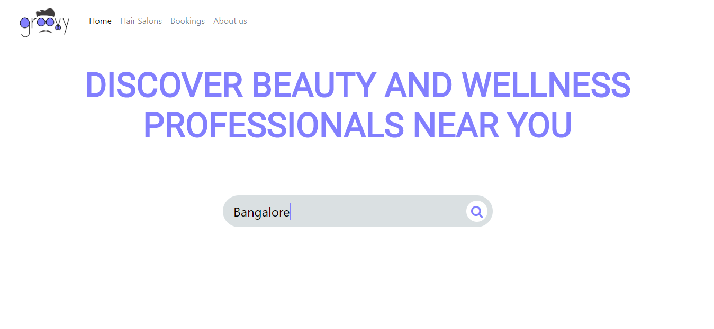

# Groovy
This application is build for Haircut Management.Customers can use this application to find near by salons and book an appointment to particular salon by choosing particular stylist and various services, at the end discounts will be calculated if any available for particular salon and a payment summary is calculated and shown to the user.
 
## Technology Used
* HTML
* CSS
* Bootstrap
* JavaScript
* JQuery
* Node JS
* Express JS
* Passport JS
* MongoDB

## Preview

